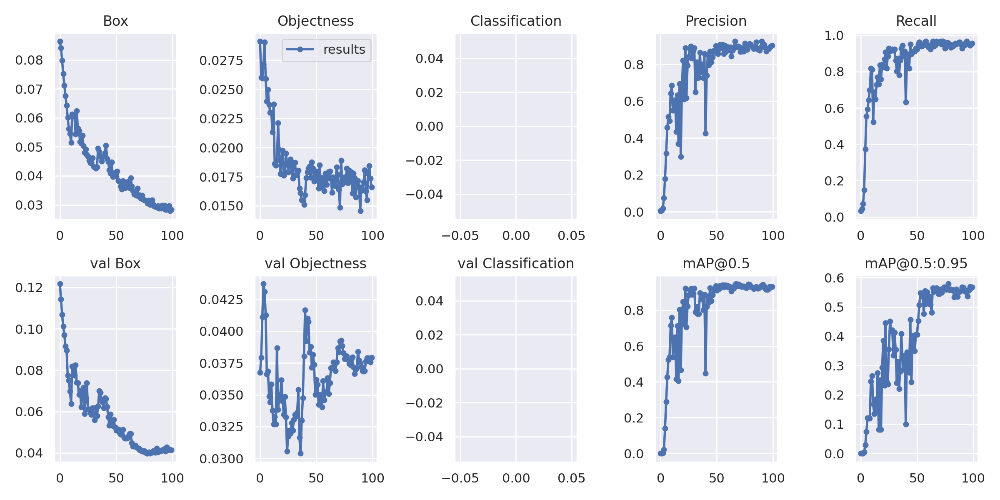

# Object Detection of IMLI
Using infrastruture of YOLOv7: https://github.com/WongKinYiu/yolov7

Pre-Trained Weights: [best.pt](https://github.com/avim3hta/imli-detection/blob/main/best.pt)

Current Stats: 

# Testing of Deployed Model:

